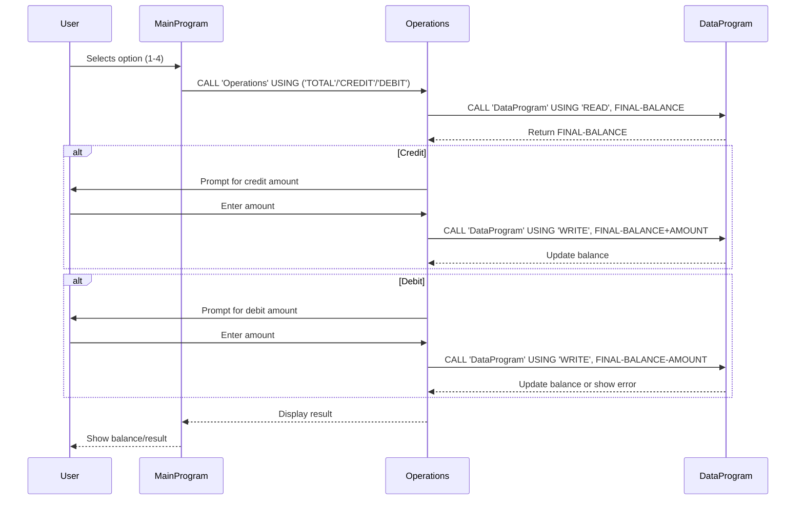

# COBOL Student Account Management System

This project is a simple COBOL-based system for managing student accounts, including viewing balances, crediting, and debiting accounts. The system is organized into three main COBOL files, each with a specific responsibility.

## File Overview

### 1. `main.cob`
**Purpose:**
- Serves as the entry point and user interface for the account management system.
- Presents a menu to the user for viewing balance, crediting, debiting, or exiting.
- Handles user input and delegates operations to the `operations.cob` module.

**Key Logic:**
- Loops until the user chooses to exit.
- Uses `CALL 'Operations'` to perform the selected action.

**Business Rules:**
- Only allows choices 1-4 (view, credit, debit, exit).
- Displays an error for invalid menu selections.

---

### 2. `operations.cob`
**Purpose:**
- Implements the core business logic for account operations.
- Handles credit, debit, and balance inquiry actions.
- Interacts with the data storage module (`data.cob`).

**Key Functions:**
- `TOTAL`: Reads and displays the current balance.
- `CREDIT`: Prompts for an amount, adds it to the balance, and updates storage.
- `DEBIT`: Prompts for an amount, checks for sufficient funds, subtracts from the balance if possible, and updates storage.

**Business Rules:**
- Prevents debiting more than the available balance (insufficient funds check).
- All balance updates are persisted via the data module.

---

### 3. `data.cob`
**Purpose:**
- Manages persistent storage of the account balance.
- Provides read and write operations for the balance.

**Key Functions:**
- `READ`: Returns the current stored balance.
- `WRITE`: Updates the stored balance with a new value.

**Business Rules:**
- All balance changes must go through this module to ensure data consistency.

---

## Business Rules Summary
- Only valid menu options (1-4) are accepted.
- Credit and debit operations require user input for the amount.
- Debit operations are only allowed if sufficient funds are available.
- All balance changes are handled through the data module to maintain integrity.

---

# Data Flow Sequence Diagram

The following sequence diagram illustrates the data flow and interactions between the user, main program, operations module, and data module in the COBOL Student Account Management System:

For more details, see the source code in the `/src/cobol/` directory.